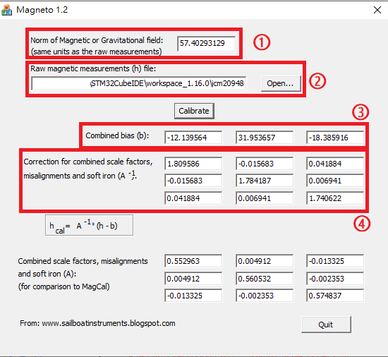

# 地磁計校準

## 概述
由於地磁計是量測環境之磁場，而每個地區的磁場也有所不同。並且也會受到硬磁、軟磁干擾，導致地磁計有所偏移、變形。此時，地磁計的校準是相對重要的，沒有良好的校準會影響姿態的準確度。

地磁校準最主要是要找出地磁的偏移以及變形量，盡量讓地磁計是一個保持在**零點**並且呈現一個**正圓**的形狀。

所以要找出它的偏移量、比例因子，分別為硬鐵值(Hard iron)、軟鐵值(Soft iron)

## 地磁計模型

$$
  m_{c} = S_{I} ( \widetilde{m}_{measure} - b_{HI} )
$$

$$
  b_{HI} = Hard\ Iron偏移
$$
$$
  S_{I} = Soft\ Iron矩陣
$$

$$
\begin{bmatrix}
  m_{c_{x}} \\
  m_{c_{y}} \\
  m_{c_{z}} \\
\end{bmatrix} = 

\begin{bmatrix}
  C_{00} & C_{01} & C_{02} \\
  C_{10} & C_{11} & C_{12} \\
  C_{20} & C_{21} & C_{22}
\end{bmatrix}

\begin{bmatrix}
  \widetilde{m_{x}} - b_{H_{0}} \\
  \widetilde{m_{y}} - b_{H_{1}} \\
  \widetilde{m_{z}} - b_{H_{2}}
\end{bmatrix}
$$

## Magneto 1.2軟體校準
透過magneto12.exe來得出上述參數，盡可能地旋轉你的設備使得數據集能描述成一個圓，並將三軸地磁計之數值打印出來並以.txt格式(即②，選擇路徑)儲存後，即可算出結果(①: 地磁範數、③: HardIron、④: SoftIron):
 

 

## 參考
1、 [Tutorial: How to calibrate a compass (and accelerometer) with Arduino](https://thecavepearlproject.org/2015/05/22/calibrating-any-compass-or-accelerometer-for-arduino/)
 
2、 [3.6 Magnetometer Hard & Soft Iron Calibration](https://www.vectornav.com/resources/inertial-navigation-primer/specifications--and--error-budgets/specs-hsicalibration)

